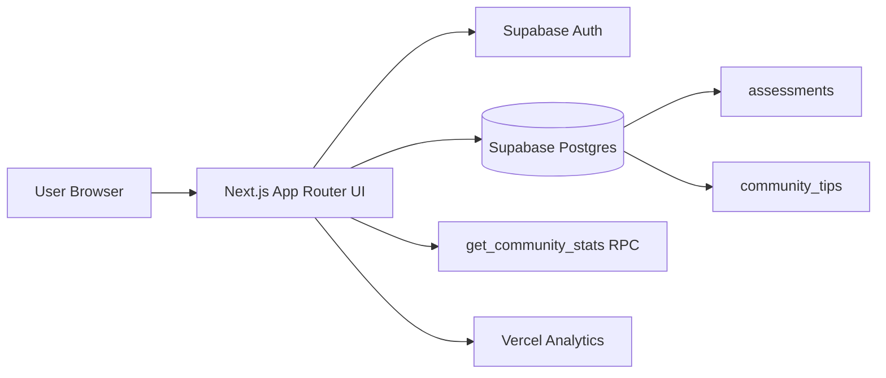
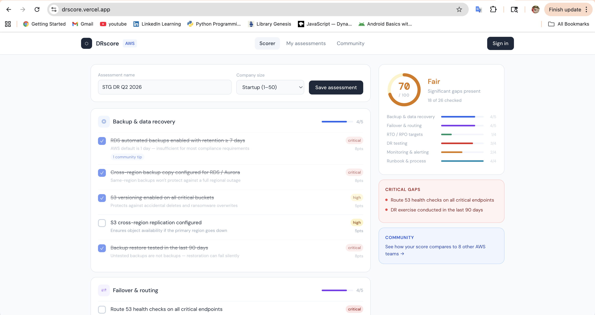

# DRscore

AWS Disaster Recovery Readiness Scorer built with Next.js + Supabase.

Assess your DR posture, save assessments, compare against community benchmark data, and collect practical recovery tips from other teams.

---

## Highlights

- Weighted AWS DR checklist scoring
- Authenticated save/load/update/delete assessments
- Duplicate-name overwrite confirmation
- Community benchmark insights (`get_community_stats`)
- Community tips feed + tip submission
- Vercel Analytics integration

## Architecture



## Screenshots




## Tech Stack

- Next.js (App Router)
- React + TypeScript
- Supabase (`@supabase/supabase-js`, `@supabase/ssr`)
- Vercel (hosting + analytics)

## Quick Start

1. Install dependencies

```bash
npm install
```

2. Add environment variables to `.env.local`

```bash
NEXT_PUBLIC_SUPABASE_URL=your_supabase_project_url
NEXT_PUBLIC_SUPABASE_ANON_KEY=your_supabase_anon_key
```

3. Start the development server

```bash
npm run dev
```

App runs at [http://localhost:3000](http://localhost:3000).

## Supabase Setup

This app expects:

- Table: `assessments`
- Table: `community_tips`
- RPC: `get_community_stats`

Fields currently used by the app:

- `assessments`: `id`, `user_id`, `name`, `score`, `checked_items`, `company_size`, `created_at`
- `community_tips`: `id`, `item_id`, `tip_text`, `author_label`, `user_id`, `created_at`

Make sure RLS policies allow authenticated users to read/write only the records they should access.

## Scripts

```bash
npm run dev    # local development
npm run build  # production build
npm run start  # run production build
npm run lint   # lint checks
```

## Deploying to Vercel

1. Push code to GitHub
2. Import repo into Vercel
3. Add required env vars in Vercel project settings
4. Deploy

## Key Files

- `app/page.tsx` - scorer UI, dashboard, and community views
- `app/auth/page.tsx` - sign in / sign up
- `app/auth/callback/route.ts` - auth callback exchange
- `utils/supabase/client.ts` - browser Supabase client
- `utils/supabase/server.ts` - server Supabase client
- `middleware.ts` - auth session middleware

## Notes

- The app works best when signed in (assessment persistence + tip posting).
- Community UI falls back to local default data if live queries fail.

## AI Future Prospects

- **Auto-generated runbook drafts**: Generate a DR runbook template from the user’s missed controls and weakest categories.
- **Prioritized recommendations**: Convert assessment gaps into ranked, high-impact next actions with suggested owners.
- **Executive summary generator**: Produce stakeholder-ready summaries of current DR posture, risk level, and immediate priorities.
- **Tip summarization and deduplication**: Cluster similar community tips, remove noise, and highlight the most actionable guidance.
