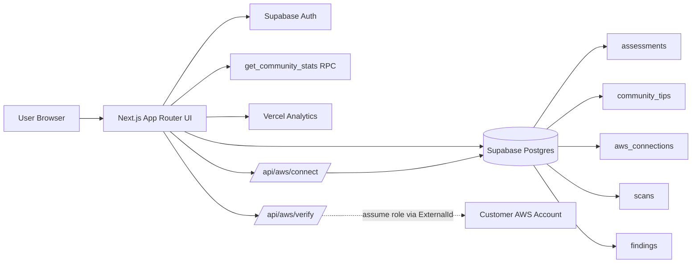
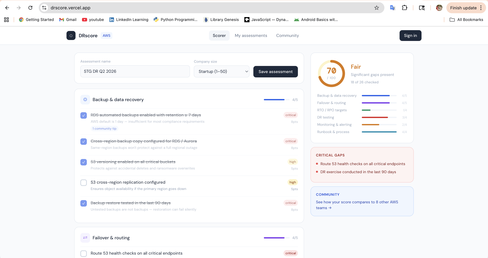

# DRscore

AWS Disaster Recovery Readiness Scorer built with Next.js + Supabase.

Assess your DR posture, save assessments, compare against community benchmark data, and collect practical recovery tips from other teams.

---

## Highlights

- Weighted AWS DR checklist scoring
- Authenticated save/load/update/delete assessments
- Duplicate-name overwrite confirmation
- Community benchmark insights (`get_community_stats`)
- Community tips feed + tip submission
- Vercel Analytics integration
- **AWS Live-Scan (in progress)** — connect a read-only, cross-account IAM role to a real AWS account via a generated CloudFormation template, so DR posture can eventually be checked against live infrastructure instead of only a self-reported checklist. See [AWS Live-Scan status](#aws-live-scan-status) below.

## Architecture


```mermaid
flowchart LR
  U[User Browser] --> A[Next.js App Router UI]
  A --> SA[Supabase Auth]
  A --> DB[(Supabase Postgres)]
  A --> RPC[get_community_stats RPC]
  DB --> T[assessments]
  DB --> C[community_tips]
  A --> VA[Vercel Analytics]
  A --> AC[/api/aws/connect/]
  A --> AV[/api/aws/verify/]
  AC --> DB
  DB --> AWSC[aws_connections]
  DB --> SC[scans]
  DB --> FI[findings]
  AV -.assume role via ExternalId.-> CUST[Customer AWS Account]
```

## Screenshots




## Tech Stack

- Next.js (App Router)
- React + TypeScript
- Supabase (`@supabase/supabase-js`, `@supabase/ssr`)
- Vercel (hosting + analytics)

## Quick Start

1. Install dependencies

```bash
npm install
```

2. Add environment variables to `.env.local`

```bash
NEXT_PUBLIC_SUPABASE_URL=your_supabase_project_url
NEXT_PUBLIC_SUPABASE_ANON_KEY=your_supabase_anon_key

# Required for the AWS Scan tab (Connect AWS Account flow).
# ARN of the AWS identity that's allowed to assume customer scanner roles —
# not customer-facing, this is DRscore's own scanner identity.
SCANNER_AWS_ACCOUNT_ARN=arn:aws:iam::<your-account-id>:user/drscore-scanner
```

3. Start the development server

```bash
npm run dev
```

App runs at [http://localhost:3000](http://localhost:3000).

## Supabase Setup

This app expects:

- Table: `assessments`
- Table: `community_tips`
- RPC: `get_community_stats`
- Table: `aws_connections`, `scans`, `findings` (AWS Live-Scan — see `supabase/migrations/`)

Fields currently used by the app:

- `assessments`: `id`, `user_id`, `name`, `score`, `checked_items`, `company_size`, `created_at`
- `community_tips`: `id`, `item_id`, `tip_text`, `author_label`, `user_id`, `created_at`
- `aws_connections`: `id`, `user_id`, `account_alias`, `role_arn`, `external_id`, `regions`, `status`, `last_verified_at`, `created_at`
- `scans`: `id`, `connection_id`, `user_id`, `status`, `overall_score`, `started_at`, `completed_at`
- `findings`: `id`, `scan_id`, `category`, `resource_type`, `resource_id`, `severity`, `title`, `detail`, `remediation`, `raw_data`

Make sure RLS policies allow authenticated users to read/write only the records they should access.

Schema changes are tracked as Supabase CLI migrations in `supabase/migrations/`. To apply them to a linked project:

```bash
npx supabase link --project-ref your-project-ref
npx supabase db push
```

## Scripts

```bash
npm run dev    # local development
npm run build  # production build
npm run start  # run production build
npm run lint   # lint checks
```

## Deploying to Vercel

1. Push code to GitHub
2. Import repo into Vercel
3. Add required env vars in Vercel project settings
4. Deploy

## Key Files

- `app/page.tsx` - scorer UI, dashboard, and community views
- `app/auth/page.tsx` - sign in / sign up
- `app/auth/callback/route.ts` - auth callback exchange
- `utils/supabase/client.ts` - browser Supabase client
- `utils/supabase/server.ts` - server Supabase client
- `middleware.ts` - auth session middleware
- `app/components/AwsConnect.tsx` - "Connect AWS Account" UI (AWS Scan tab)
- `app/api/aws/connect/route.ts` - creates/lists AWS connections, returns IAM policy + CloudFormation template
- `app/api/aws/verify/route.ts` - verifies a connection's IAM role is assumable (stub — see status below)
- `utils/aws/scannerRole.ts` - shared IAM policy, trust policy, and CloudFormation template generation

## Notes

- The app works best when signed in (assessment persistence + tip posting).
- Community UI falls back to local default data if live queries fail.

## AWS Live-Scan status

Multi-phase feature to connect a real AWS account (read-only, via cross-account IAM role assumption — no stored access keys) and detect DR weaknesses automatically instead of only through the self-reported checklist.

- [x] **Phase 1 — Connection flow & data model**: `aws_connections`/`scans`/`findings` tables with RLS, "Connect AWS Account" UI, generates a per-connection external ID + least-privilege IAM policy + one-click CloudFormation template.
- [ ] **Phase 2 — Verification & scanning backend**: real `sts:AssumeRole` check, first scan checks (RDS Multi-AZ, AWS Backup coverage, EC2/EBS snapshot freshness).
- [ ] **Phase 3 — Frontend**: scan results view (score, findings grouped by category/severity, remediation).
- [ ] **Phase 4 — Remaining checks & multi-region**: S3 replication, Route 53 failover, DynamoDB global tables, Aurora Global Database, Resilience Hub, looped across all connected regions.

Right now, "Verify connection" always returns "coming in Phase 2" — creating a connection and seeing the IAM setup instructions works end-to-end, but no live scanning happens yet.

## AI Future Prospects

- **Auto-generated runbook drafts**: Generate a DR runbook template from the user’s missed controls and weakest categories.
- **Prioritized recommendations**: Convert assessment gaps into ranked, high-impact next actions with suggested owners.
- **Executive summary generator**: Produce stakeholder-ready summaries of current DR posture, risk level, and immediate priorities.
- **Tip summarization and deduplication**: Cluster similar community tips, remove noise, and highlight the most actionable guidance.
